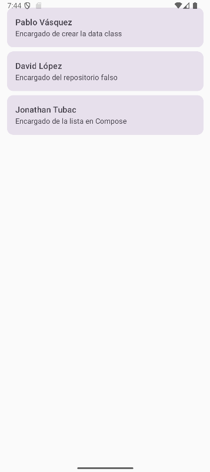

# TeamApp - UVG 2025 Lab 4

## Resumen
TeamApp es una aplicación Android simple desarrollada en Kotlin utilizando Jetpack Compose. La aplicación muestra una lista de los miembros del equipo con sus nombres y roles, cumpliendo con los requisitos del Laboratorio 4 del curso UVG 2025. El proyecto demuestra el uso de Git y GitHub para un desarrollo colaborativo, incluyendo ramas de características, pull requests (PRs) y revisiones de código.

## Características
- **Clase de Datos TeamMember**: Una clase de datos `TeamMember` en el paquete `model` para almacenar el nombre y la descripción de cada miembro.
- **Repositorio Falso**: Un `FakeTeamRepository` que proporciona una lista codificada de los miembros del equipo.
- **Pantalla de Lista de Equipo**: Un Composable `TeamListScreen` que muestra los miembros del equipo en un `LazyColumn` con tarjetas individuales.

## Miembros del Equipo
- **Pablo Vásquez**: Creó la clase de datos `TeamMember`.
- **David López**: Desarrolló el `FakeTeamRepository`.
- **Jonathan Tubac**: Implementó el `TeamListScreen` con `LazyColumn`.

## Capturas de Pantalla
A continuación, se muestran capturas de pantalla de la aplicación ejecutándose en el emulador de Android:



*La pantalla principal mostrando la lista de miembros del equipo en un LazyColumn.*

## Flujo de Trabajo y Proceso en GitHub
Seguimos un flujo de trabajo estructurado con Git para garantizar una colaboración limpia y ordenada:

1. **Fork y Configuración**:
    - El equipo hizo un fork del repositorio inicial desde [franzueto/uvg-2025-lab4-team-app](https://github.com/franzueto/uvg-2025-lab4-team-app).
    - Cada miembro clonó el repositorio forkeado en su entorno local.

2. **Ramas de Características**:
    - Cada miembro creó una rama de característica específica:
        - `feat/dataClass-imp` para la clase de datos `TeamMember`.
        - `feat/fake-repo` para el `FakeTeamRepository`.
        - `Feature/ComposableLazyMemberList` para el Composable `TeamListScreen`.
    - Los commits fueron pequeños y descriptivos.

3. **Pull Requests y Revisiones de Código**:
    - Cada miembro abrió un Pull Request (PR) desde su rama de característica hacia la rama `develop` en el repositorio forkeado.
    - Los compañeros revisaron los PRs, dejando comentarios constructivos..
    - Los PRs fueron aprobados solo después de abordar los comentarios, asegurando la calidad del código integrado.
    - Ejemplo de títulos de PR: `Agregar clase de datos TeamMember`, `Implementar FakeTeamRepository`, `Agregar TeamListScreen con LazyColumn`.

4. **Integración Final**:
    - Una vez que todas las características fueron integradas en la rama `develop` de nuestro repositorio forkeado, se creó un PR final desde nuestra rama `develop` hacia la rama `develop` del repositorio original.
    - Todo el equipo revisó el PR final para asegurar que todas las características funcionaran de manera cohesiva antes de la aprobación.

5. **Historial de Git**:
    - El historial del repositorio refleja la creación de ramas de características, commits descriptivos, PRs y revisiones de código.
    - La rama `develop` contiene el trabajo integrado, mientras que la rama `main` permanece sin cambios según los requisitos.

## Cómo Ejecutar
1. Clona el repositorio:
   ```bash
   git clone https://github.com/PabloVS044/uvg-2025-lab4-team-app.git
   ```
2. Abre el proyecto en Android Studio.
3. Sincroniza el proyecto con Gradle.
4. Ejecuta la aplicación en un emulador de Android o dispositivo físico.

## Dependencias
- Kotlin
- Jetpack Compose
- Componentes Material de Android

## Notas
- La aplicación utiliza recursos de cadenas (`strings.xml`) para los nombres y descripciones de los miembros del equipo para garantizar la mantenibilidad.
- La clase de datos `TeamMember` utiliza `Int` para los IDs de recursos, según la implementación proporcionada, para referenciar cadenas desde `strings.xml`.
- La pantalla opcional `TeamDetailScreen` y la navegación no se implementaron en esta versión, pero pueden añadirse en iteraciones futuras.
- El equipo aseguró un diseño de código modular, con cada Composable y clase teniendo una sola responsabilidad.
